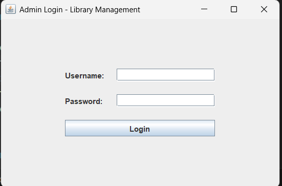
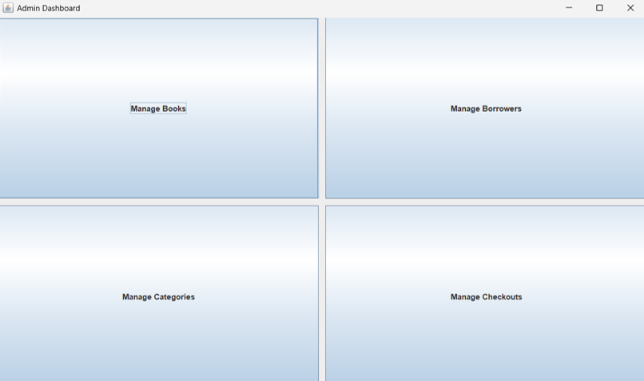
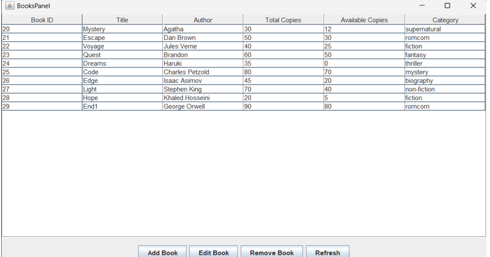
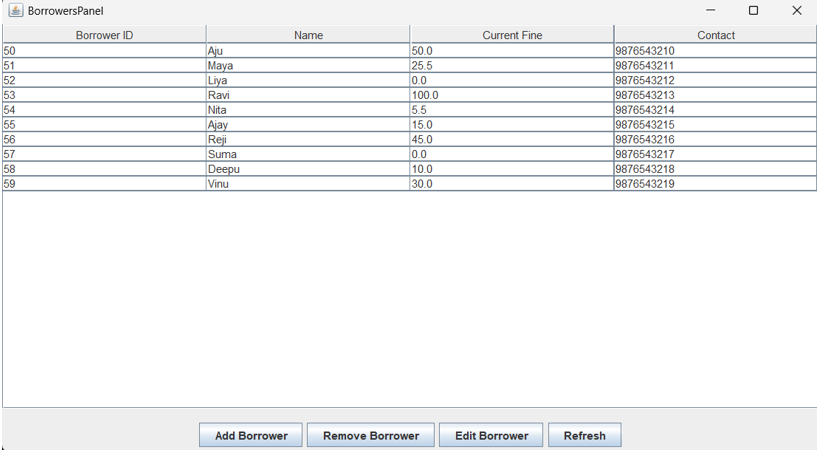
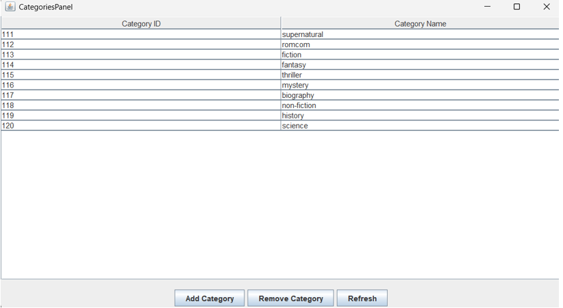
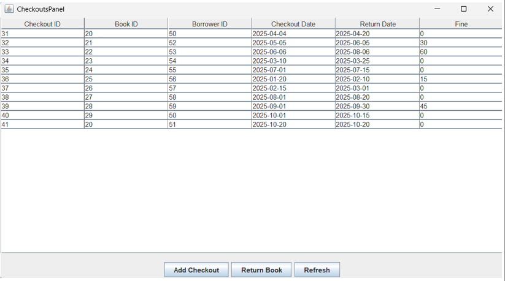

# Library Management System

A desktop based Library Management System built using Java Swing and MySQL.  
This application was developed as a DBMS project during my third year of BTech, with a focus on real world database driven workflows and clean system design.

---

## Overview

The system helps manage books, borrowers, categories, and checkouts through a graphical Java Swing interface connected to a MySQL database.  
It supports core library operations such as issuing books, tracking availability, detecting overdue returns, and managing borrower fines.

This project emphasizes practical use of relational databases, SQL queries, and Java database connectivity using JDBC.

---

## Key Features

- Admin login authentication  
- Add, edit, delete, and view books  
- Category wise book management  
- Borrower management with fine tracking  
- Issue and return books with real time availability updates  
- Automatic overdue detection after 30 days  
- Fine calculation linked directly to borrowers  
- Normalized relational database design  
- Referential integrity using primary and foreign keys  

---

## Tech Stack

- Frontend: Java Swing  
- Backend: MySQL  
- Database Connectivity: JDBC  
- Tools: VS Code, MySQL Workbench  

---

## Database Design Overview

The database follows a normalized relational structure with the following tables:

- Departments  
- Students (Borrowers)  
- Books  
- Courses  
- Enrollments (Checkouts)  

Foreign key constraints are used to maintain referential integrity and ensure consistent data across operations.

---

## Project Structure

src/
├─ admin/
│ ├─ AdminLogin.java
│ ├─ AdminDashboard.java
│ ├─ BooksPanel.java
│ ├─ BorrowersPanel.java
│ ├─ CategoriesPanel.java
│ └─ CheckoutsPanel.java
│
├─ user/
│ ├─ UserLogin.java
│ └─ UserDashboard.java
│
└─ db/
└─ DBConnection.java

lib/
└─ mysql-connector-j-9.4.0.jar

---

## Code Overview

**DBConnection.java**  
Manages JDBC connectivity and acts as a centralized database access layer.

**AdminLogin.java**  
Handles admin authentication before allowing dashboard access.

**AdminDashboard.java**  
Acts as the main control panel with tab based navigation between modules.

**BooksPanel.java**  
Displays book records and manages add, edit, delete operations with real time updates.

**BorrowersPanel.java**  
Manages borrower details and fine tracking.

**CategoriesPanel.java**  
Handles category creation and deletion with dependency checks.

**CheckoutsPanel.java**  
Manages book issue and return logic including overdue detection and fine updates.

---

## Screenshots

### Admin Login

### Dashboard

### Books Management

### Borrower Management

### Category Management

### Issue and Return Books

---

## What This Project Demonstrates

- Strong understanding of SQL queries, joins, and constraints  
- Proper use of primary and foreign keys  
- Practical JDBC based database connectivity  
- Clean separation of UI and database logic  
- Real world data integrity and validation handling  

---

## How to Run

1. Install MySQL and create the required tables.
2. Update database credentials in `DBConnection.java`.
3. Add the MySQL JDBC connector to the project classpath.
4. Compile and run the application using your IDE.

---

## Author

Ajay  
BTech Computer Science Engineering
